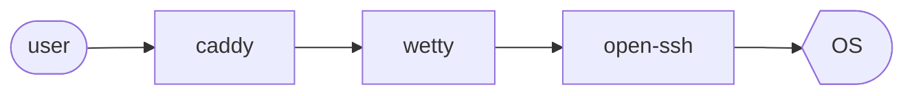

# ssh via web
## architecture


## how to generate password
```
caddy.basicauth.bobby: J5clIuNFB....
```

```sh
hashed_password=`docker run --rm caddy caddy hash-password --plaintext my-secret-password`
echo $hashed_password # check for one line password
export caddy_basicauth_bobby=`echo -n $hashed_password | base64`
```

## create docker network
```sh
docker-compose up -d -e MY_PASSWORD=$caddy_basicauth_bobby
```